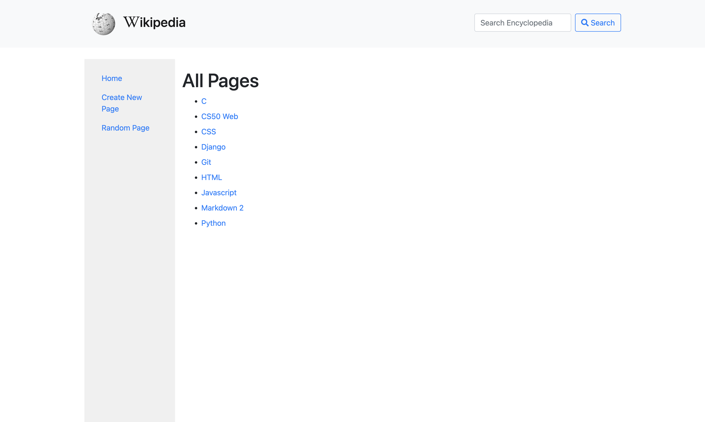

# CS50W Wiki Project

## Overview
This repository contains my second project for the CS50W Web Programming with Python and JavaScript course. In this project, I've built a simplified clone of Wikipedia, enabling users to create, edit, and search for encyclopedia entries using HTML, Django, and Markdown.

## Video Demonstration
For a quick demonstration of this project and a walkthrough of its required specifications, watch this [YouTube video](https://youtu.be/HH48wkqnoug).

## Assignment Specifications

In this project, I've implemented a Wiki encyclopedia, and the following requirements were fulfilled:

- **Entry Page**: When users visit /wiki/entryTITLE, where entryTITLE is the title of an encyclopedia entry, they are presented with a page displaying the contents of that entry.
  - The content retrieval is done by calling the appropriate util function.
  - If a requested entry does not exist, users are shown an error page indicating that their requested page was not found.
  - If the entry exists, users are presented with a page displaying the entry's content, and the page title includes the entry's name.

- **Index Page**: I've updated index.html to allow users to click on any entry name and be taken directly to that entry's page.

- **Search**: Users can type a query into the search box in the sidebar to search for an encyclopedia entry.
  - If the query matches an encyclopedia entry name, users are redirected to that entry's page.
  - If the query doesn't match an entry name, users are taken to a search results page showing a list of all encyclopedia entries with the query as a substring. For instance, if the search query is "ytho," the search results will display "Python."
  - Clicking on any entry name in the search results page takes users to that entry's page.

- **New Page**: Clicking "Create New Page" in the sidebar takes users to a page where they can create a new encyclopedia entry.
  - Users can enter a title for the page and provide Markdown content in a textarea.
  - A button allows users to save their new page.
  - If an encyclopedia entry with the same title already exists, users are presented with an error message.
  - Otherwise, the new encyclopedia entry is saved to disk, and users are redirected to the new entry's page.

- **Edit Page**: On each entry page, users can click a button to access a page for editing that entry's Markdown content in a textarea.
  - The textarea is pre-populated with the existing Markdown content of the entry.
  - Users can save the changes they make to the entry.
  - After saving, users are redirected back to the entry's page.

- **Random Page**: Clicking "Random Page" in the sidebar takes users to a random encyclopedia entry.

- **Markdown to HTML Conversion**: All Markdown content in an entry file is converted to HTML before being displayed to the user. I've used the **python-markdown2** package to perform this conversion, which is installable via `pip3 install markdown2`.

I've tailored this Wiki encyclopedia to fulfill these specific requirements, ensuring a seamless and user-friendly experience.

## Technologies Used
- Django
- Markdown 2
- HTML
- CSS

## Note
This project is intended for educational purposes only and does not constitute an official Wikimedia product or service.

## Explore the Code
Feel free to explore the code in this repository for a closer look at the implementation details.

Happy Coding!
